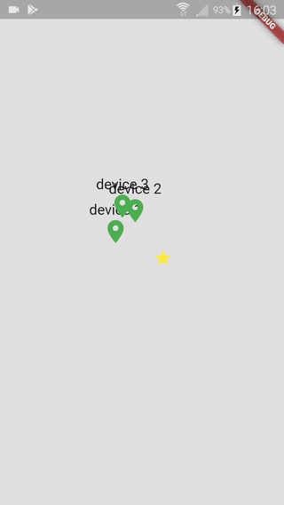

# Fluxmap

A map to handle real time location updates for multiple devices. The map takes a
stream of [Device](https://github.com/synw/device) objects for input and manages
their state on the map

- **Automatic network status** management: the devices network status is calculated
from their last position report. Callbacks are available for state changes
- **Access to the map state**: the state of the map is available via a provider

## Screenshot



## Usage

### Declare state mutations actions

Define you callbacks and options for devices state changes:

   ```dart
   final flux = FluxMapState(
      onDeviceDisconnect: (device) =>
          print("Device ${device.name} is disconnected"),
      onDeviceOffline: (device) =>
          print("Device ${device.name} is offline"),
      onDeviceBackOnline: (device) =>
          print("Device ${device.name} is back online"),
      markerGestureDetectorBuilder: (context, device, child) {
          return GestureDetector(
              child: child,
              onTap: () {
                print("Tap $device");
              },
              onDoubleTap: () {
                print("Double tap $device");
              },
              onLongPress: () {
                print("Long press $device");
              });
      });
   ```

### Use the positions stream

Create a stream controller for your positions updates:

   ```dart
   final StreamController<Device> _devicesFlux = StreamController<Device>();
   ```

Place the map widget in your widgets tree:

   ```dart
   Widget map = FluxMap(state: flux,
           devicesFlux: _devicesFlux.stream));
   ```

Then feed the map with location updates:

   ```dart
   final device = Device(
      name: "phone 1",
      position: GeoPoint(latitude: 0.0, longitude: 0.0, speed: 31.0));
   _devicesFlux.sink.add(device);_
   ```

### Use map controls

To manage the map assets and controls an instance of
[Map controller](https://github.com/synw/map_controller) is available:

   ```dart
   flux.map.addMarker(name: "My marker",
                      marker: Marker( /* A Flutter Map marker*/))
   ```

### Access to the map state

It is possible to plug on the map state with Provider: in a parent widget:

   ```dart
   import 'package:fluxmap/fluxmap.dart';
   import 'package:provider/provider.dart';

   @override
   Widget build(BuildContext context) {
     return StreamProvider<FluxMapStore>.value(
         initialData: FluxMapStore(),
         value: fluxMapStoreController.stream,
         child: MyWidget());
   }
   ```

In the widget:

   ```dart
   @override
   Widget build(BuildContext context) {
     final mapState = Provider.of<FluxMapStore>(context).state;
     final device = mapState.devices[deviceId];
     Color color;
     switch (device.networkStatus) {
       case DeviceNetworkStatus.online:
         color = Colors.green;
         break;
       case DeviceNetworkStatus.disconnected:
         color = Colors.orange;
         break;
       case DeviceNetworkStatus.offline:
         color = Colors.lightBlueAccent;
         break;
       default:
         color = Colors.grey[300];
     }
     /// ...
     return SomeWidget();
   }
   ```
